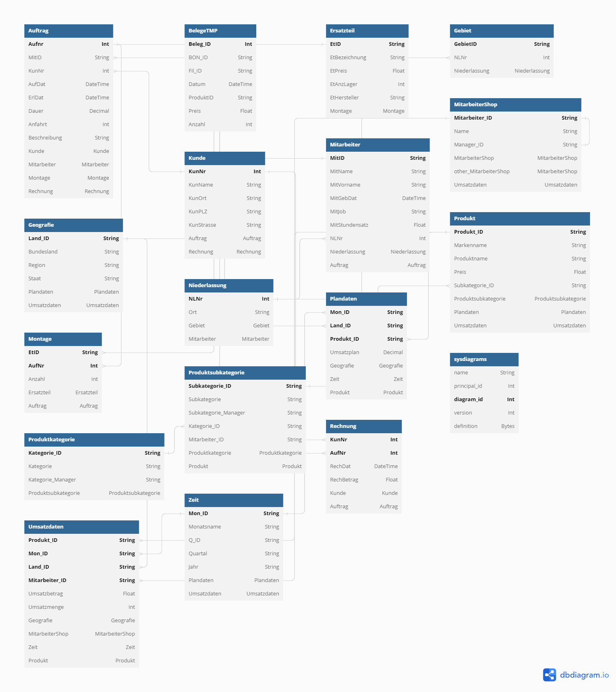

# Trommelhelden Webfrontend

## Start Backend Dev Server
1. Create .env file in backend folder containing the following string

`DATABASE_URL="sqlserver://141.56.2.45:1433;database=iw19sxxxxx;user=sxxxxx;password=xxxxx;trustServerCertificate=true;" `

2. Connect to HTW VPN via CISCO client
3. install dependencies `npm i`
4. run `npx prisma db pull --schema=./src/prisma/schema.prisma` to pull schema from db
4. run `npx prisma generate --schema=./src/prisma/schema.prisma` to generate DB schema
5. run `cd backend && npm run dev` to start backend dev server on `localhost:5000`

## Start Prisma GUI 

run `cd backend && npx prisma studio --schema=./src/prisma/schema.prisma`

## Start Frontend Dev Server
1. run `cd frontend && npm i`
2. run `npm run dev` to run frontend dev server on `localhost:3000`

### DB Schema

